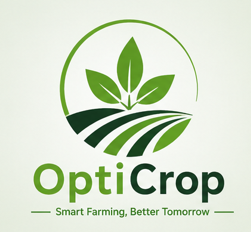

# 🌿 OptiCrop - Smart Agricultural Production Optimization Engine

<p align="center">



</p>

<p align="center">

### AI Powered Crop Recommendation System using Machine Learning

</p>

---

# 📖 Overview

OptiCrop is an Artificial Intelligence based Crop Recommendation System developed to assist farmers, researchers, and agricultural stakeholders in selecting the most suitable crop based on soil nutrients and climatic conditions.

The application uses Machine Learning algorithms to analyze important agricultural parameters such as Nitrogen (N), Phosphorous (P), Potassium (K), Temperature, Humidity, Soil pH, and Rainfall, and predicts the best crop for maximum productivity.

The project is developed as part of the **SmartBridge Internship Program**.

---

# 🎯 Problem Statement

Selecting the right crop is one of the biggest challenges faced by farmers.

Crop productivity depends on multiple environmental and soil factors such as:

- Nitrogen
- Phosphorous
- Potassium
- Temperature
- Humidity
- Soil pH
- Rainfall

Most farmers rely on traditional methods and experience for crop selection, which may lead to low productivity and inefficient resource utilization.

OptiCrop solves this problem using Machine Learning by recommending the most suitable crop based on the given environmental conditions.

---

# 🎯 Objectives

- Develop an AI-powered crop recommendation system.
- Predict the best crop using soil nutrient values.
- Improve agricultural productivity.
- Reduce crop selection errors.
- Encourage sustainable farming practices.
- Help researchers analyze crop-environment relationships.

---

# 🌾 Features

- Smart Crop Recommendation
- Machine Learning Prediction
- Random Forest Classification
- Soil Nutrient Analysis
- Climate Analysis
- Responsive Flask Web Application
- Modern Bootstrap User Interface
- High Prediction Accuracy (99.55%)

---

# 📊 Dataset Information

Dataset Name

Crop Recommendation Dataset

Total Records

2200

Number of Features

8

Input Features

- Nitrogen (N)
- Phosphorous (P)
- Potassium (K)
- Temperature
- Humidity
- Soil pH
- Rainfall

Target Variable

Crop Name

Number of Crop Classes

22

---

# 🌱 Supported Crops

- Rice
- Maize
- Chickpea
- Kidney Beans
- Pigeon Peas
- Moth Beans
- Mung Bean
- Black Gram
- Lentil
- Pomegranate
- Banana
- Mango
- Grapes
- Watermelon
- Muskmelon
- Apple
- Orange
- Papaya
- Coconut
- Cotton
- Jute
- Coffee

---

# 🛠 Technologies Used

## Programming Language

- Python

## Frontend

- HTML5
- CSS3
- Bootstrap 5
- JavaScript

## Backend

- Flask

## Machine Learning

- Scikit-Learn
- Random Forest Classifier

## Data Analysis

- Pandas
- NumPy
- Matplotlib
- Seaborn

## Model Storage

- Joblib

---

# 📂 Project Structure

```
OptiCrop/
│
├── app.py
├── train_model.py
├── data_analysis.py
├── data_preprocessing.py
├── requirements.txt
├── README.md
│
├── dataset/
│     Crop_recommendation.csv
│
├── model/
│     crop_model.pkl
│     scaler.pkl
│     label_encoder.pkl
│
├── static/
│     css/
│        style.css
│
│     js/
│        script.js
│
│     images/
│        hero.jpg
│        about.jpg
│        logo.png
│
└── templates/
      base.html
      home.html
      about.html
      predict.html
      result.html
```

---

# 🔄 Project Workflow

```
Dataset Collection

↓

Data Analysis

↓

Data Preprocessing

↓

Feature Selection

↓

Data Splitting

↓

Model Training

↓

Model Evaluation

↓

Model Saving

↓

Flask Integration

↓

Frontend Development

↓

Crop Prediction
```

---

# 📈 Data Analysis

The dataset was analyzed using Pandas and Matplotlib.

Performed:

- Dataset inspection
- Missing value checking
- Duplicate checking
- Statistical summary
- Correlation analysis
- Data visualization

---

# 🧹 Data Preprocessing

The preprocessing stage included:

- Checking missing values
- Removing duplicate records
- Feature selection
- Label Encoding
- Feature Scaling using StandardScaler
- Train-Test Split

Training Data

80%

Testing Data

20%

---

# 🤖 Machine Learning Model

The following Machine Learning models were trained and compared.

| Algorithm | Accuracy |
|------------|-----------|
| Random Forest | **99.55%** |
| Decision Tree | 97.95% |
| KNN | 97.95% |
| Logistic Regression | 97.27% |

Random Forest achieved the highest accuracy and was selected as the final model.

---

# 📊 Model Evaluation

The model was evaluated using:

- Accuracy
- Precision
- Recall
- F1 Score
- Classification Report
- Confusion Matrix

Final Accuracy

**99.55%**

---

# 💾 Model Saving

The trained model was saved using Joblib.

Generated Files

```
crop_model.pkl

scaler.pkl

label_encoder.pkl
```

These files are loaded during prediction.

---

# 🌐 Flask Web Application

The Flask application contains:

### Home Page

Project introduction and navigation.

### About Page

Detailed information about the project.

### Find Your Crop

User enters:

- Nitrogen
- Phosphorous
- Potassium
- Temperature
- Humidity
- pH
- Rainfall

### Result Page

Displays the recommended crop.

---

# 🖥 Website Pages

- Home
- About
- Find Your Crop
- Result

---

# 📥 User Input

The user provides

- N
- P
- K
- Temperature
- Humidity
- pH
- Rainfall

The application processes these inputs and predicts the most suitable crop.

---

# 🚀 Installation

Clone Repository

```bash
git clone https://github.com/YOUR_USERNAME/OptiCrop.git
```

Go into the project

```bash
cd OptiCrop
```

Install packages

```bash
pip install -r requirements.txt
```

Run application

```bash
python app.py
```

Open

```
http://127.0.0.1:5000
```

---

# 📷 Screenshots

## Home Page

(Add Screenshot)

## About Page

(Add Screenshot)

## Prediction Page

(Add Screenshot)

## Result Page

(Add Screenshot)

---

# 🎯 Future Enhancements

- Fertilizer Recommendation
- Disease Detection
- Weather API Integration
- Multi-language Support
- Voice Assistance
- Mobile Application
- Cloud Deployment
- Live Weather Prediction

---

# 👩‍💻 Team Members

### Team Leader

Sri Veni Yellaboyina

### Team Members

- Jaswanth Sai Ram Marrivada
- Tinotenda Karl Mazura
- Blessed Zambezi
- Kushal Sai Kumar Antarvedi

---

# ⭐ Conclusion

OptiCrop is an intelligent crop recommendation system that leverages Machine Learning to assist farmers in making informed agricultural decisions.

By analyzing soil nutrients and environmental conditions, the system predicts the most suitable crop with an accuracy of **99.55%** using the Random Forest algorithm.

The project demonstrates the practical application of Artificial Intelligence in agriculture and contributes toward improving crop productivity, sustainable farming practices, and efficient resource utilization.

---

<p align="center">

Made with ❤️ using Python, Flask and Machine Learning

</p>
