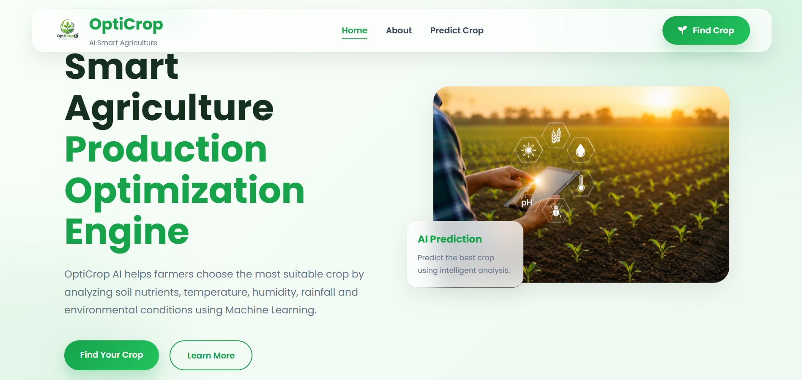
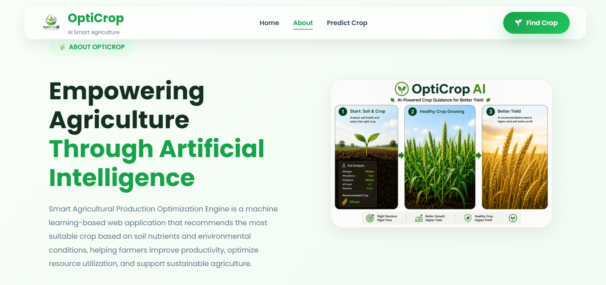
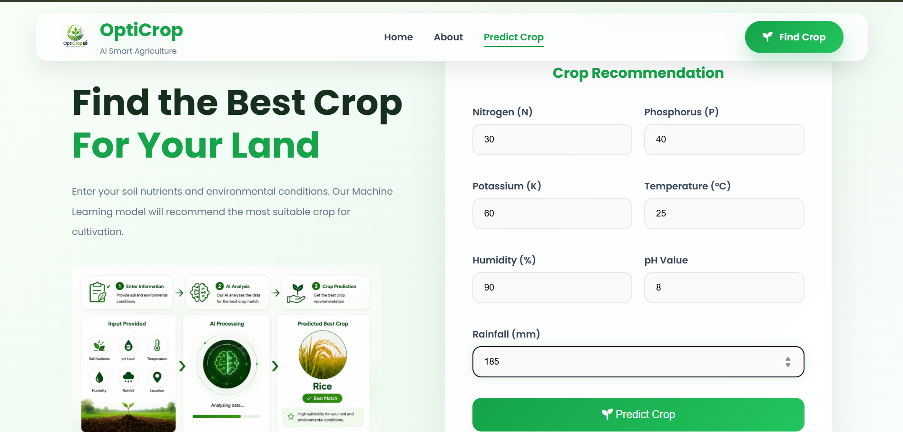
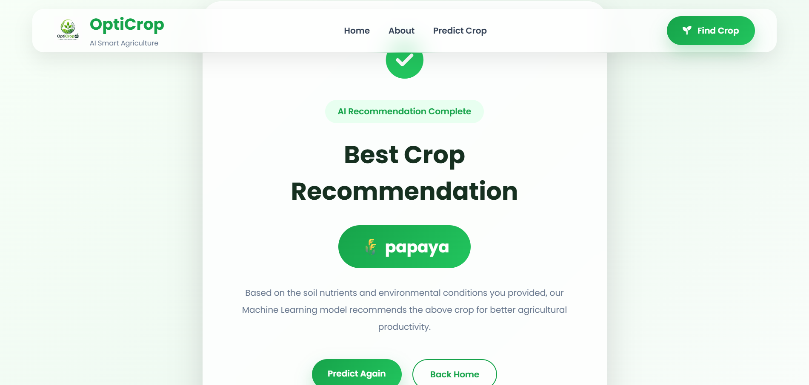

# 🌱 OptiCrop – Smart Agriculture Production Optimization Engine

OptiCrop is a **Machine Learning-based Crop Recommendation System** developed using **Python, Flask, and Scikit-learn**. The application predicts the most suitable crop for cultivation by analyzing soil nutrients and environmental conditions. It helps users make informed agricultural decisions using a trained **Random Forest Classifier**.

---

## 🔗 Live Demo

**Deployment URL:** *Add your Render deployment link here after deployment.*

---

## 📌 Features

- 🌾 Recommends the most suitable crop based on soil and weather conditions.
- 🤖 Machine Learning-powered prediction using a trained Random Forest model.
- 🌐 Responsive web application built with Flask.
- 📊 Simple and user-friendly interface for entering agricultural data.
- ⚡ Provides instant crop recommendations with high prediction accuracy.
- 📱 Clean and responsive design compatible with desktop and mobile devices.

---

## 🛠️ Technologies Used

### Programming Languages

- Python
- HTML5
- CSS3
- JavaScript

### Framework

- Flask

### Machine Learning

- Scikit-learn
- Pandas
- NumPy
- Joblib / Pickle

### Development Tools

- Visual Studio Code
- Git
- GitHub
- Render

---

## 📂 Project Structure

```text
Opti_Crop/
│
├── app.py
├── requirements.txt
├── README.md
├── dataset/
│   └── Crop_recommendation.csv
├── model/
│   ├── crop_model.pkl
│   ├── scaler.pkl
│   └── label_encoder.pkl
├── static/
│   ├── css/
│   ├── images/
│   └── js/
├── templates/
│   ├── base.html
│   ├── home.html
│   ├── about.html
│   ├── predict.html
│   └── result.html
└── .gitignore
```

---

## 📊 Input Parameters

The application predicts the most suitable crop using the following parameters:

- Nitrogen (N)
- Phosphorus (P)
- Potassium (K)
- Temperature (°C)
- Humidity (%)
- Soil pH
- Rainfall (mm)

---

## 🌾 Output

Based on the input values, the system recommends the most suitable crop for cultivation.

---

## 🤖 Machine Learning Model

The prediction model was developed using the **Random Forest Classifier**, which provides high accuracy for crop recommendation tasks.

### Workflow

- Data Collection
- Data Preprocessing
- Feature Selection
- Model Training
- Model Evaluation
- Model Serialization using Joblib/Pickle
- Real-time Prediction through Flask

---

## 🚀 Installation

### Clone the Repository

```bash
git clone https://github.com/Sriveniyellaboyina/Opti_Crop.git
```

### Navigate to the Project Directory

```bash
cd Opti_Crop
```

### Install Dependencies

```bash
pip install -r requirements.txt
```

### Run the Application

```bash
python app.py
```

Open your browser and visit:

```text
http://127.0.0.1:5000
```

---

## 📸 Application Screenshots

### 🏠 Home Page



### ℹ️ About Page



### 🌱 Crop Prediction Page



### ✅ Prediction Result



---

## 🎯 Future Enhancements

- Real-time weather integration
- Soil health analysis
- Fertilizer recommendation
- Crop yield prediction
- Disease detection using Deep Learning
- Multi-language support
- Farmer Dashboard
- Weather API Integration

---

## 📚 Learning Outcomes

This project demonstrates practical knowledge of:

- Machine Learning
- Data Preprocessing
- Classification Algorithms
- Flask Web Development
- Frontend Development
- Model Deployment
- Git & GitHub
- Cloud Deployment using Render

---

## 📄 License

This project is developed for **educational and learning purposes**.

---

## ⭐ Support

If you found this project helpful, consider giving this repository a **⭐ Star** on GitHub.
